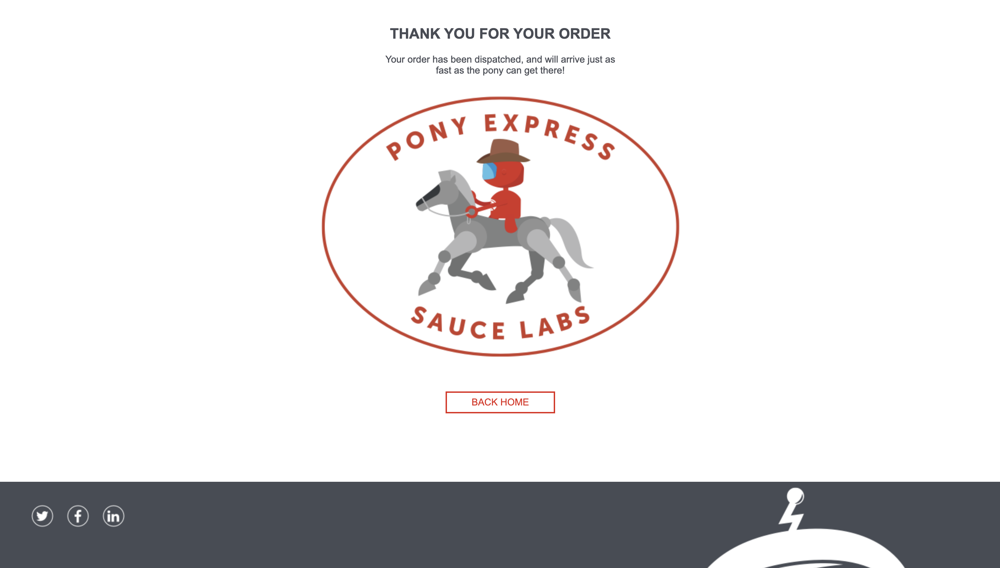

# Minimal Python (Pytest + Selenium) Page Object Model

Tests purchase process on https://www.saucedemo.com

## Test steps:
### Log in to the service

### Build a cart
Provide just the item names as list of strings, test suite will count actual cart value. Check if number of items is displayed on the button in the top right corner.

### Make sure the cart is built successfully
Check if the names and prices are correct.

### Checkout
Fill the form and proceed with the purchase.

### Purchase overview
Make sure that the total amount to be paid is equal to the sum of all chosen items.

### Finish page
Check if "thank you" message is displayed. Use "go back home" button.
